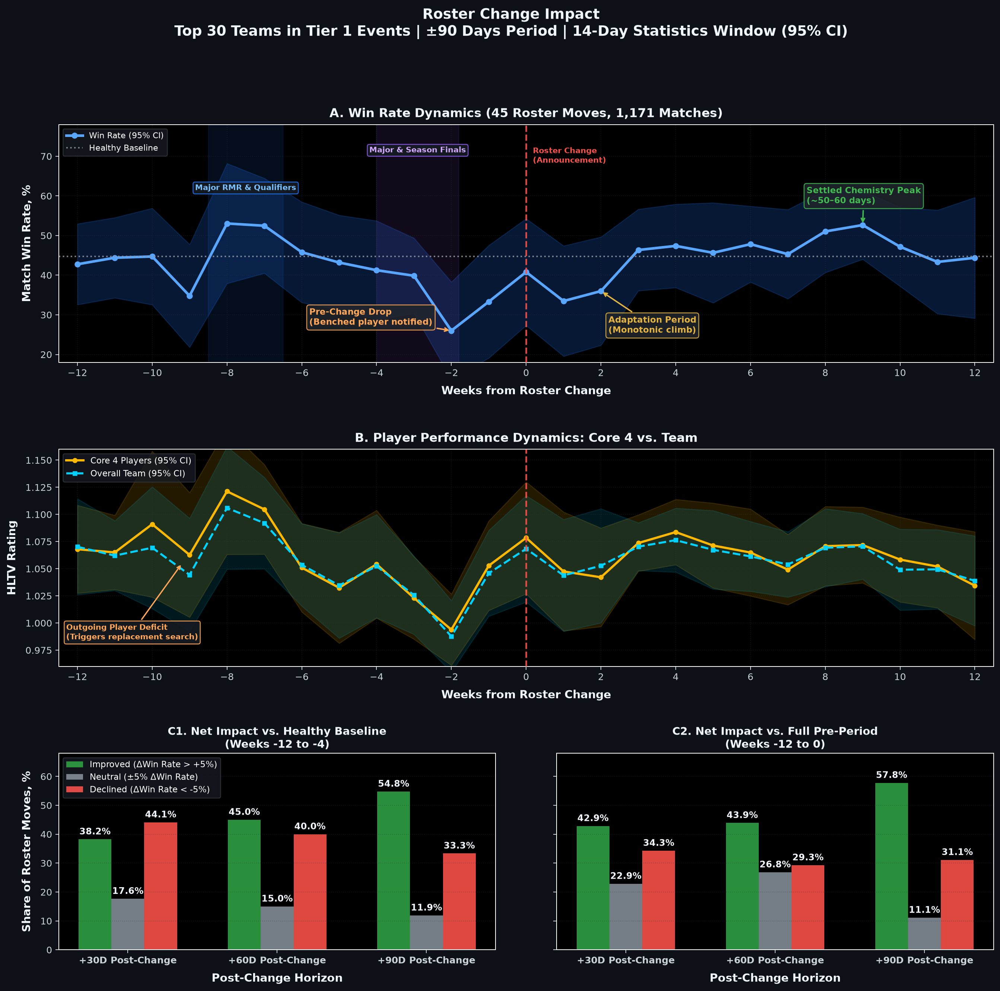
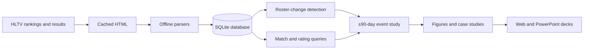
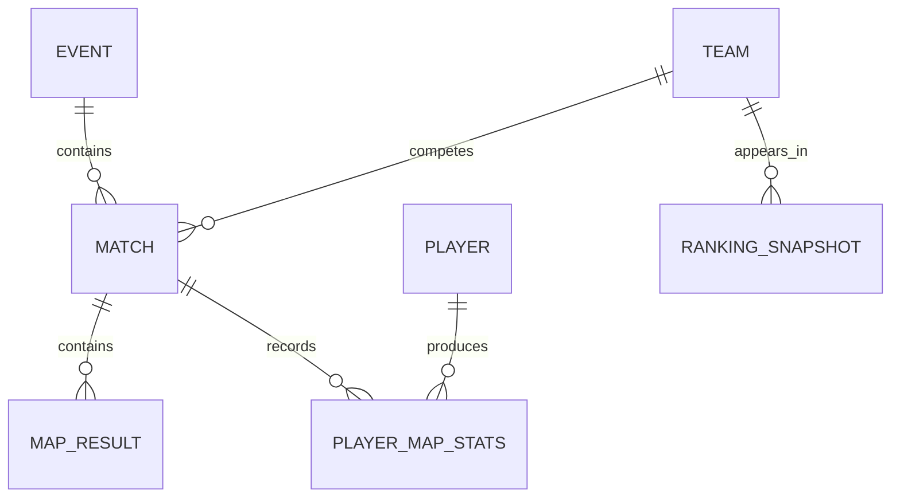

# CS2 Roster Dynamics

<div align="center">

**An end-to-end empirical study of how single-player roster changes affect elite Counter-Strike 2 teams.**

[](https://www.python.org/)
[](https://www.sqlite.org/)
[](https://www.hltv.org/)
[](#project-status)

From cached HLTV pages to a relational database, reproducible event-study figures, team case studies, and presentation-ready storytelling.

[Open the final deck](#final-submission-deck) · [Explore the findings](#key-findings) · [Run the analysis](#quick-start) · [Understand the method](#methodology)

</div>



> [!IMPORTANT]
> **Final submission:** [`presentation/presentation.html`](presentation/presentation.html) is the finished presentation deck. It contains 13 core slides and 2 appendix slides designed for an 8-minute classroom presentation. The other files under `presentation/` are supporting or legacy materials, not alternate final submissions.

## Research question

> **When a Top 30 CS2 team replaces one of its five active players, does performance improve—and is the improvement sustained in Tier 1 competition?**

This repository investigates that question with weekly team rankings, match results, event metadata, map scores, player statistics, and observed five-player lineups. The primary analysis aligns qualifying roster moves on a common event date and follows team performance for 90 days before and after each change.

## Key findings

| Finding | Current result |
|---|---:|
| Clean, isolated one-player moves | **39** |
| Tier 1 matches evaluated | **1,107** |
| Pre-change trough | **35% win rate at Week −2** |
| Early adaptation shock | **38% win rate at Week +1** |
| Post-change peak | **55% win rate at Week +8** |
| Trough-to-peak recovery | **+19 percentage points** |
| Sustained positive trajectory at 90 days | **50–51%** |
| Moves with a decline greater than 5 points | **37%** |
| Team rating vs. win-rate correlation | **r = +0.87, R² = 0.76** |

The central result is nuanced: aggregate performance recovers after an initial adjustment period, but an individual roster move remains close to a coin flip at the 90-day horizon. These are observational patterns, not proof that the substitution itself caused the outcome.

## What is included

- A five-stage HLTV ingestion pipeline with disk caching and retry behavior.
- A bundled SQLite database containing rankings, events, matches, maps, players, lineups, and player-map statistics.
- Detection of isolated one-for-one roster changes from weekly five-player snapshots.
- A ±90-day team-level event study with minimum-sample filters and 95% confidence intervals.
- Static and animated rating-versus-win-rate analysis.
- Four detailed team case studies: Vitality, Falcons, MOUZ, and NAVI.
- A final 15-slide, 8-minute classroom presentation.
- Supplementary speaker notes, a technical deep-dive deck, a PowerPoint, and reusable presentation assets.

## Final submission deck

### `presentation/presentation.html` — final deck

Open [`presentation/presentation.html`](presentation/presentation.html) for the finished audience-facing presentation. This is the deck intended for submission and delivery. It contains **13 core slides plus 2 appendix slides** and covers the CS2 context, data pipeline, schema, filtering funnel, aggregate findings, strategic implications, ethics, limitations, and Q&A material.

Controls:

| Action | Control |
|---|---|
| Advance / reveal | `→`, `Space`, or `Page Down` |
| Go back | `←`, `Backspace`, or `Page Up` |
| First / last slide | `Home` / `End` |
| Full screen | `F` |
| Start or pause the 8-minute timer | `T` |

### Supporting presentation materials

These files are included as extras and do not replace the final deck:

| File | Role |
|---|---|
| [`presentation/presentation.md`](presentation/presentation.md) | Speaker notes, slide-by-slide timing, and appendix guidance for the final deck |
| [`presentation/index.html`](presentation/index.html) | Supplementary 7-slide technical deep dive with the four team case studies |
| [`presentation/CS2_Roster_Dynamics_RQ1.pptx`](presentation/CS2_Roster_Dynamics_RQ1.pptx) | Supplementary 7-slide PowerPoint version of the technical material |
| [`presentation/assets/`](presentation/assets/) | Images, plots, video, and other media used by the presentations |

The supplementary PowerPoint can be regenerated with:

```bash
python analysis/roster_changes/generate_presentation_pptx.py
```

### Present locally

Opening the final HTML file directly works in most browsers. For the most reliable video, font, and asset loading during submission or presentation, serve the `presentation/` directory locally:

```bash
python -m http.server 8080 --directory presentation
```

Then visit:

- **Final deck:** <http://localhost:8080/presentation.html>
- Supplementary technical deck: <http://localhost:8080/index.html>

## Quick start

### 1. Clone and install

```bash
git clone https://github.com/vagizD/cs2.git
cd cs2

python3 -m venv .venv
source .venv/bin/activate  # Windows PowerShell: .venv\Scripts\Activate.ps1
python -m pip install --upgrade pip
pip install -r requirements.txt
```

Python 3.11 or newer is recommended for the pinned dependency set.

### 2. Reproduce the final aggregate event study

The processed database is already included, so the principal analysis can be run without scraping HLTV again:

```bash
python analysis/roster_changes/plot_aggregated_roster_dynamics.py \
  --db-path data/processed/hltv_database.db \
  --cohort top30 \
  --event-tier "Tier 1" \
  --isolation-days 90 \
  --min-matches 15 \
  --min-matches-mode total \
  --min-matches-per-window 2 \
  --mode raw \
  --window-type trailing \
  --window-days 14 \
  --output-name aggregated_roster_dynamics_isolated_90d.png
```

Output: `data/visualization/roster_changes/aggregated_roster_dynamics_isolated_90d.png`

### 3. Generate the supporting visuals

```bash
# All four team case studies
python analysis/roster_changes/plot_team_case_studies.py \
  --team all \
  --window-size 10

# Static Tier 1 rating-versus-win-rate figure
python analysis/roster_changes/plot_tier1_winrate_vs_rating.py \
  --mode raw \
  --min-matches 10

# Animated 90-day rolling view, sampled weekly
python analysis/roster_changes/animate_tier1_winrate_vs_rating.py \
  --mode raw \
  --window-days 90 \
  --stride-days 7 \
  --min-matches 7 \
  --fps 12 \
  --pause-sec 2
```

## Methodology

### Analysis funnel

The current presentation reports the following filtering path:

```text
1,775 observed snapshot changes
  └─ 456 involving a team that held a Top 30 ranking
      └─ 317 with exactly one player added and one removed
          └─ 256 with at least 90 days of snapshot history on both sides
              └─ 70 with no other roster change inside the ±90-day window
                  └─ 39 with sufficient Tier 1 match coverage
                     (1,107 matches in the final event-study sample)
```

### Event definition

A roster-change event qualifies when:

1. Consecutive weekly ranking snapshots contain five valid players.
2. Exactly one player is added and one player is removed.
3. No other detected roster change occurs in the preceding or following 90 days.
4. At least 90 days of ranking history exist before and after the change.
5. The team belongs to the dynamic Top 30 cohort when `--cohort top30` is used.
6. Under the final configuration, the event has at least 15 Tier 1 matches across the full ±90-day period, with at least 3 matches on each side.

### Panel construction

- Each event is evaluated from Week −12 through Week +12.
- The final figure uses trailing 14-day windows.
- A team-event contributes to a window only when it has at least 2 matches in that window.
- Statistics are averaged within each team-event first, then across events. This prevents match-heavy teams from dominating the aggregate.
- Error bands are calculated from the cross-team standard error of the mean and shown as 95% confidence intervals.
- The analysis tracks match win rate, team/player rating trajectories, and success distributions at 30, 60, and 90 days.

### Success definitions

For each horizon, a win-rate change is classified as:

- **Improved:** more than +5 percentage points.
- **Neutral:** between −5 and +5 percentage points, inclusive.
- **Declined:** less than −5 percentage points.

Two baselines are reported:

- **Healthy baseline:** Days −90 through −28, excluding the immediate pre-change slump.
- **Full pre-period:** Days −90 through 0, including the slump.

### Rating modes

- `raw` uses the rating values stored in the database.
- `normalized` standardizes ratings within the code's Rating 1.0, 2.0, and 3.0 eras, then maps the z-score to a common scale centered at 1.00 with a 0.20 spread.

## Data pipeline



The live ingestion runner executes:

1. Weekly ranking discovery from 2024 onward and dynamic cohort creation.
2. Match-result discovery, filtered to the cohort by default.
3. Match-page ingestion and lineup extraction.
4. Event metadata ingestion.
5. Map and player-statistics ingestion.

The client reads the local cache first, uses `curl_cffi` for requests, waits 1–2 seconds between uncached requests, and refreshes browser-derived cookies with `nodriver` after a 403 response.

### Run ingestion

Start with the small sample mode:

```bash
python run_ingestion.py --sample --db data/processed/sample.db
```

Run the full, cohort-filtered pipeline:

```bash
python run_ingestion.py --db data/processed/hltv_database.db
```

Include matches outside the discovered cohort:

```bash
python run_ingestion.py --all-matches --db data/processed/hltv_database.db
```

> [!IMPORTANT]
> Scraping can take a long time and creates a large raw cache. `data/raw/` and `data/logs/` are intentionally excluded from Git; the project notes that the raw HTML cache can exceed 16 GB. Review HLTV's current terms and use considerate request rates before collecting data.

### Rebuild from an existing raw cache

```bash
python scripts/build_database.py
```

> [!WARNING]
> The rebuild script deletes `data/processed/hltv_database.db` before recreating it and expects populated `data/raw/rankings`, `events`, `matches`, and `stats` directories. Back up the database first. The raw cache is not included in this repository.

## Database

The repository includes `data/processed/hltv_database.db`. The recorded snapshot contains:

| Table / entity | Rows | Contents |
|---|---:|---|
| `ranking_snapshot` | 34,826 | Weekly team rank, points, and five-player lineup |
| `match` | 17,821 | Match time, teams, score, format, maps, and lineups |
| `map_result` | 25,784 | Per-map scores and overtime flag |
| `player_map_stats` | 257,867 | K/D/A, ADR, KAST, rating, and role flags |
| `player` | 3,264 | Unique player catalog |
| `team` | 1,580 | Unique team catalog |
| `event` | — | Date, location, prize pool, LAN status, type, and tier |

### Schema relationships



### Query helpers

`src/analysis/queries.py` exposes reusable pandas-based queries for:

- Top players by map count.
- Team ranking history.
- Match outcomes and format filtering.
- Map-pool performance.
- Detailed player performance.
- Detected lineup changes.
- Event summaries.
- Matches filtered by LAN status, tier, format, or prize pool.

Example:

```python
from src.analysis.queries import get_team_ranking_history

history = get_team_ranking_history("Vitality")
print(history.head())
```

## Case studies

| Team | Change date | Move | Narrative covered by the project |
|---|---|---|---|
| Vitality | 2025-01-13 | `+ropz`, `−Spinx` | Rapid integration followed by elite Tier 1 form and a three-event winning run |
| MOUZ | 2025-01-27 | `+Spinx`, `−siuhy` | Early role disruption followed by recovery after the adjustment period |
| NAVI | 2025-07-14 | `+makazze`, `−jL` | Initial inconsistency followed by a strong late-window run |
| Falcons | 2026-04-20 | `+karrigan`, `−kyxsan` | Leadership change, rising form, and a championship peak in the tracked window |

Each case-study figure combines rolling team win rate, player/core rating trajectories, tournament context, and annotations tied to the configured roster event.

## Command reference

| Script | Purpose | Useful options |
|---|---|---|
| `run_ingestion.py` | Collect and store rankings, results, matches, events, and stats | `--sample`, `--all-matches`, `--db` |
| `scripts/build_database.py` | Rebuild SQLite from cached raw HTML | No CLI options; uses fixed project paths |
| `plot_aggregated_roster_dynamics.py` | Generate the principal event-study figure | `--isolation-days`, `--min-matches`, `--min-matches-mode`, `--min-matches-per-window`, `--cohort`, `--event-tier`, `--mode`, `--window-type`, `--window-days` |
| `plot_team_case_studies.py` | Generate one or all configured team studies | `--team`, `--window-size`, `--out-dir` |
| `plot_tier1_winrate_vs_rating.py` | Generate the static rating/win-rate comparison | `--mode`, `--start-date`, `--end-date`, `--months`, `--min-matches` |
| `animate_tier1_winrate_vs_rating.py` | Generate the rolling-window GIF | `--mode`, `--window-days`, `--stride-days`, `--min-matches`, `--fps`, `--pause-sec`, `--output` |
| `generate_presentation_pptx.py` | Rebuild the technical PowerPoint | Uses the default project asset paths |

## Repository structure

```text
.
├── README.md
├── requirements.txt
├── run_ingestion.py
├── analysis/
│   └── roster_changes/
│       ├── animate_tier1_winrate_vs_rating.py
│       ├── generate_presentation_pptx.py
│       ├── plot_aggregated_roster_dynamics.py
│       ├── plot_team_case_studies.py
│       └── plot_tier1_winrate_vs_rating.py
├── data/
│   ├── processed/
│   │   └── hltv_database.db
│   └── visualization/
│       └── roster_changes/
├── presentation/
│   ├── assets/                            # Media used by the decks
│   ├── presentation.html                  # FINAL 8-minute submission deck
│   ├── presentation.md                    # Speaker notes and timing
│   ├── index.html                         # Supplementary technical deck
│   └── CS2_Roster_Dynamics_RQ1.pptx       # Supplementary technical PowerPoint
├── scripts/
│   └── build_database.py
├── src/
│   ├── analysis/queries.py
│   ├── db/
│   │   ├── helper.py
│   │   ├── schema.py
│   │   └── storage.py
│   ├── graph/objects/
│   └── sourcing/
│       ├── client.py
│       ├── collectors/
│       └── parsers/
├── plan/
│   ├── data/
│   ├── idea/
│   └── storytelling/
└── tests/
```

## Limitations

- The study is observational; roster decisions are not randomly assigned, so the estimates should not be interpreted as causal effects.
- Strict isolation improves internal clarity but leaves only 39 qualifying events.
- Team-level 95% confidence intervals overlap substantially in parts of the trajectory; the results are stronger as directional evidence than as definitive statistical proof.
- Weekly snapshots approximate the timing of a roster change and may not capture every announcement, stand-in, or internal decision date.
- Team form, schedule strength, coaching, player health, role fit, motivation, transfers, and organizational conflict are not fully observed.
- Event-tier labels and player ratings inherit the conventions and limitations of the source data and parsers.
- Current automated tests are not yet implemented (`tests/` contains only a placeholder).

## Project status

- Data ingestion pipeline: **complete**
- Processed database: **included**
- Aggregate and case-study analyses: **complete**
- Final submission deck (`presentation/presentation.html`): **complete**
- Final-deck assets and speaker notes: **included**
- Supplementary technical HTML and PowerPoint materials: **included**
- Automated test suite: **not yet implemented**

## Data source and attribution

Data is collected from [HLTV.org](https://www.hltv.org/). This is an independent research project and is not affiliated with or endorsed by HLTV, Valve, or the teams and players discussed. Counter-Strike and Counter-Strike 2 are trademarks of Valve Corporation.

## License

No license file is currently included in the repository. Unless a license is added, standard copyright restrictions apply; do not assume permission to redistribute the code, database, or media assets.

---

<div align="center">

Built to turn roster-change intuition into a transparent, reproducible analytical workflow.

</div>
