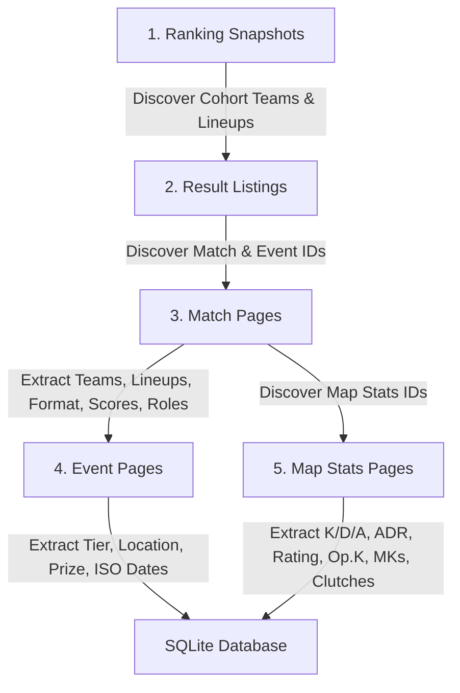

# Data Ingestion & Parallel Pipeline (`plan/data/`)

## 1. Discovery & Scraping Flow

---

## 2. Rebuild Pipeline (`scripts/build_database.py`)

- **Parallel Processing**: Uses Python `multiprocessing.Pool` across all available CPU cores (15 cores) to process cached HTML files in `data/raw/`.
- **Deduplication**:
  - `ranking_snapshot`: Deduplicated by `(snapshot_date, team_id)`.
  - `event`: Deduplicated by `event_id`.
  - `match`: Deduplicated by `match_id`.
  - `map_result`: Deduplicated by `map_stats_id`.
  - `player_map_stats`: Deduplicated by `(map_stats_id, player_id)`.
- **Post-Ingestion Recalculation**: Runs `Storage.recalculate_match_scores()` to compute maps won from map results and normalize all BO1 matches to `1-0` or `0-1`.
